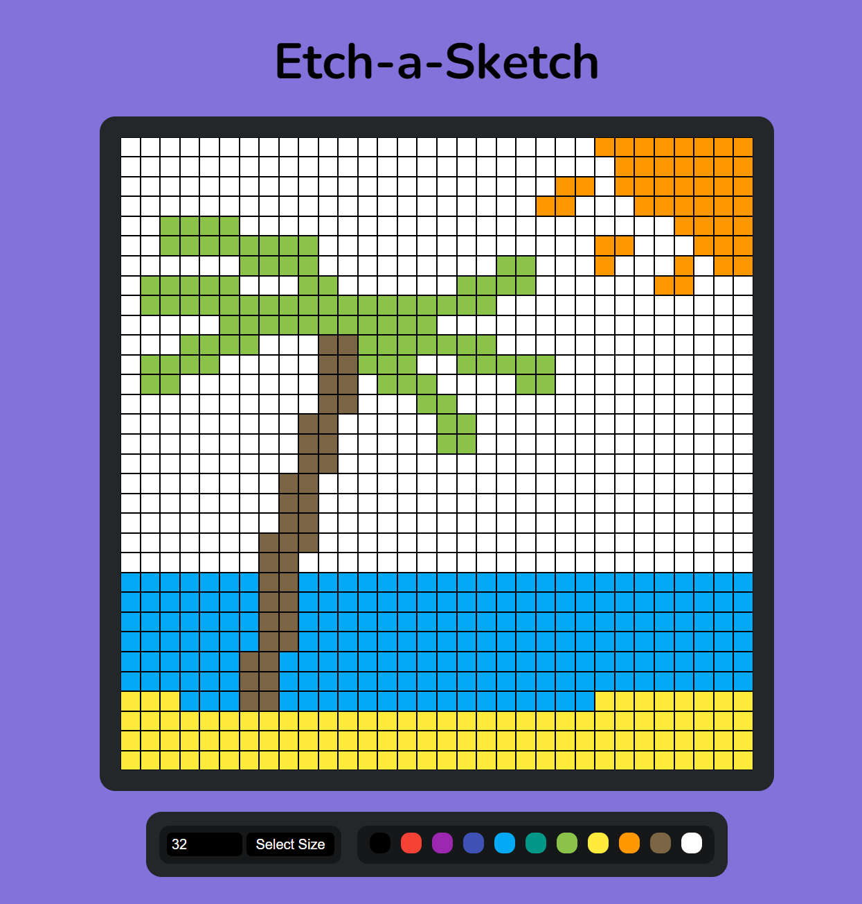

# Etch-a-Sketch

This project was a lot of fun because I thought it was cool to be able to draw myself. But I also had a problem with the creation, it was difficult for me that you only draw when you hold down the left click. If you use 'mousedown' it only affects the box you click on and not the one you hover over. The solution is to always ask for the mouse button status and use 'mouseover'.

Preview: [Etch-a-Sketch](https://lordofghost.github.io/Etch-a-Sketch/)
